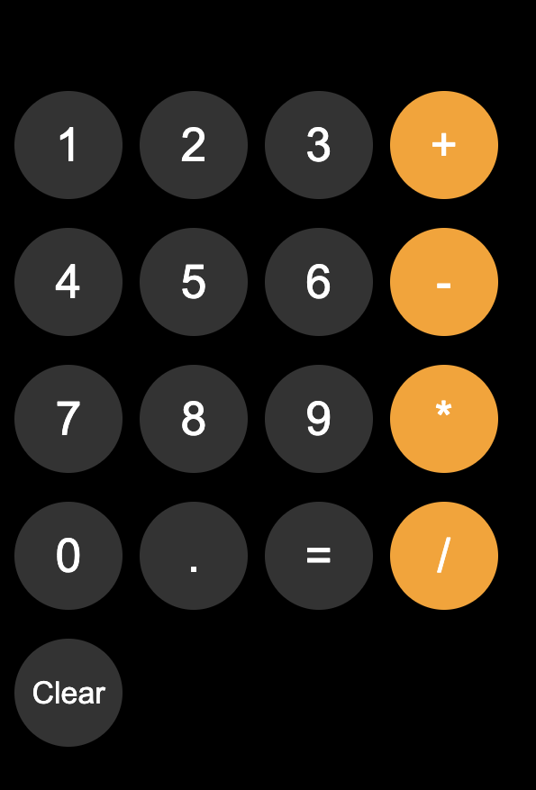

# js-calculator
Simple Calculator
This is a simple calculator project built with HTML, CSS, and JavaScript. It provides basic arithmetic operations such as addition, subtraction, multiplication, and division.

<h2>Features :- </h2>

<ul>
  <li>Basic Arithmetic: Supports addition (+), subtraction (-), multiplication (*), and division (/).</li>
  <li>Clear Button: Resets the calculation to start fresh.</li>
  <li>Decimal Support: Allows decimal point inputs.</li>
  <li>Live Calculation Display: The current calculation is displayed and updated in real-time as you input values.</li>
  <li>Local Storage: Saves your current calculation locally, so the calculation is preserved even after the page is refreshed.</li>
</ul>

<h2>Files :- </h2>

<ul>
  <li>calculator.html: Contains the structure and layout of the calculator using HTML. Buttons are styled with classes and have corresponding actions via onclick handlers.</li>
  <li>calculator.css: Handles the styling, ensuring a dark mode theme with a user-friendly button design. Buttons are color-coded for easy recognition.</li>
  <li>calculator.js: JavaScript file managing the logic of the calculator. It uses local storage to keep track of the calculation and updates the display in real-time.</li>
</ul>

<h2>How to Use :- </h2>

<ul>
  <li>Clone or download the repository.</li>
  <li>Open calculator.html in a browser.</li>
  <li>Click the buttons to perform calculations.</li>
  <li>Use the "Clear" button to reset the calculation.</li>
</ul>

<h2>Screenshot :- </h2>

